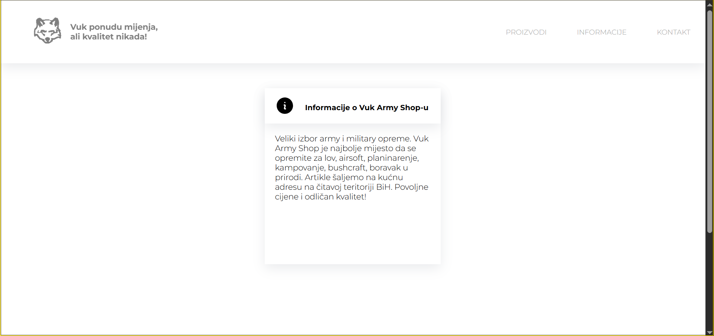
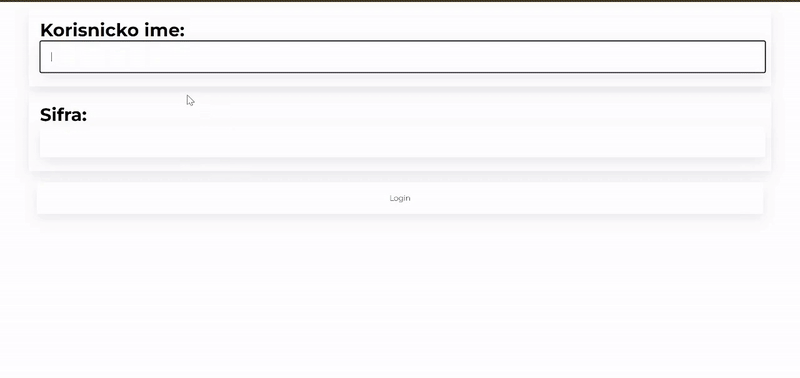

# 🐺 VukArmyShop

The **VukArmyShop** is a fully custom-built webshop for a military clothing store based in Bosnia. Designed and developed from scratch, the site features a modern interface, structured product categories, and dynamic elements—all optimized for a smooth and intuitive shopping experience. This project was built independently, with a focus on clean code and full-stack functionality.

---

### 📦 Tech Stack

- 🎨 HTML5 & CSS3 – Semantic structure and responsive, custom styling  
- 🔢 JavaScript – Frontend interactivity and dynamic UI elements  
- 💻 PHP – Server-side logic, form handling, and admin functionalities  
- 📁 MySQL – Database storage for products, articles, and admin data  

---

### 🖼️ How It Works

Here’s a sneak peek of how the webshop functions:


Product listing and product detail example:


Info page:



Secret admin panel (shhh 🤫):



---

### 🚀 How to Run Locally

1. Clone this repository:
   ```bash
   git clone https://github.com/harunridjevic/vukarmyshop.git
   cd vukarmyshop
   ```
2. Make sure you have a local server set up (like **XAMPP**, **MAMP**, or **Laragon**).
3. Import the provided SQL file into your local MySQL server.
4. Place the project folder in your server’s root directory (`htdocs` for XAMPP).
5. Start Apache and MySQL, then open your browser and visit:
   ```
   http://localhost/vukarmyshop
   ```
#### Or you can just go to http://vukarmyshop.atwebpages.com

---

### 💡 Features

- 🧱 Modern and intuitive UI, built with pure frontend code  
- 👢 Products categorized for easy navigation  
- 🖼️ Multiple images per product for detailed previews  
- 📞 Contact section with store information  
- 🔐 Hidden admin panel for managing products and content  
- 🌍 Tailored specifically for a Bosnian audience  

---

### 👨‍💼 Created By

This project was developed by **Harry Cashworth**.

---

### 📄 License

**All rights reserved.**

This code is provided for viewing purposes only.  
**Do not copy, modify, distribute, or use** any part of this project without explicit permission.

